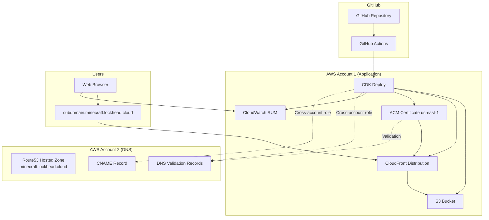

# Design Document

## Overview

This design outlines the implementation of AWS infrastructure using CDK in TypeScript to host a Flutter web application. The solution includes S3 static hosting, CloudFront distribution, CloudWatch RUM monitoring, GitHub Actions CI/CD, and custom domain configuration with cross-account DNS management.

## Architecture

### High-Level Architecture



### Component Architecture

The solution consists of several key components:

1. **CDK Infrastructure Stack**: Main TypeScript CDK application
2. **GitHub Actions Workflow**: CI/CD pipeline for automated deployment
3. **Cross-Account DNS Management**: Handles certificate validation and DNS records
4. **Monitoring Setup**: CloudWatch RUM integration

## Components and Interfaces

### CDK Stack Structure

```typescript
// Main stack interface
interface WebHostingStackProps extends StackProps {
  domainName: string;
  hostedZoneId: string;
  crossAccountRoleArn: string;
  environment: 'dev' | 'staging' | 'prod';
}

// Core constructs
class WebHostingStack extends Stack {
  - s3Bucket: Bucket
  - cloudFrontDistribution: Distribution
  - certificate: Certificate
  - rumApplication: CfnAppMonitor
}
```

### Key Components

#### 1. S3 Static Website Hosting
- **Purpose**: Store and serve Flutter web build artifacts
- **Configuration**: 
  - Block public access (served only through CloudFront)
  - Versioning enabled for rollback capability
  - Lifecycle policies for cost optimization
  - Proper CORS configuration for web assets

#### 2. CloudFront Distribution
- **Purpose**: Global CDN with custom domain and SSL
- **Configuration**:
  - Origin Access Control (OAC) for S3 access
  - Custom domain with ACM certificate
  - Optimized caching behaviors for Flutter assets
  - Security headers and HTTPS redirect
  - Error pages configuration (404 -> index.html for SPA)

#### 3. ACM Certificate
- **Purpose**: SSL/TLS certificate for custom domain
- **Configuration**:
  - Created in us-east-1 (required for CloudFront)
  - DNS validation using Route53 in external account
  - Automatic renewal enabled

#### 4. CloudWatch RUM
- **Purpose**: Real user monitoring and analytics
- **Configuration**:
  - Application monitor for web performance
  - Custom metrics and dimensions
  - Cost-optimized sampling rate
  - Integration with Flutter web app

#### 5. Cross-Account DNS Management
- **Purpose**: Manage DNS records in external AWS account
- **Implementation**:
  - Custom CDK construct for cross-account operations
  - IAM role assumption for Route53 access
  - Certificate validation record creation
  - CNAME record for subdomain

### GitHub Actions Workflow

#### Workflow Structure
```yaml
# Trigger: Push to main branch
# Jobs:
#   1. Build Flutter Web
#   2. Deploy CDK Infrastructure
#   3. Upload Assets to S3
#   4. Invalidate CloudFront Cache
```

#### Required Secrets
- `AWS_ACCESS_KEY_ID`: AWS credentials for deployment account
- `AWS_SECRET_ACCESS_KEY`: AWS secret for deployment account
- `CROSS_ACCOUNT_ROLE_ARN`: Role ARN for DNS account access
- `DOMAIN_NAME`: Target subdomain (e.g., app.minecraft.lockhead.cloud)
- `HOSTED_ZONE_ID`: Route53 hosted zone ID in DNS account

## Data Models

### Configuration Models

```typescript
interface DeploymentConfig {
  environment: Environment;
  domainConfig: DomainConfig;
  monitoringConfig: MonitoringConfig;
  cachingConfig: CachingConfig;
}

interface DomainConfig {
  domainName: string;
  hostedZoneId: string;
  crossAccountRoleArn: string;
  certificateRegion: string;
}

interface MonitoringConfig {
  rumAppName: string;
  samplingRate: number;
  enabledMetrics: string[];
}

interface CachingConfig {
  defaultTtl: number;
  maxTtl: number;
  staticAssetsTtl: number;
}
```

### CDK Resource Models

```typescript
interface S3BucketConfig {
  bucketName: string;
  versioning: boolean;
  publicReadAccess: boolean;
  lifecycleRules: LifecycleRule[];
}

interface CloudFrontConfig {
  domainNames: string[];
  certificateArn: string;
  originAccessControl: OriginAccessControl;
  cacheBehaviors: CacheBehavior[];
  errorConfigurations: ErrorResponse[];
}
```

## Error Handling

### Deployment Error Handling

1. **CDK Deployment Failures**
   - Rollback mechanism for failed deployments
   - Detailed error logging and reporting
   - Retry logic for transient failures
   - Validation checks before deployment

2. **Cross-Account Access Failures**
   - Proper error messages for role assumption failures
   - Fallback mechanisms for DNS operations
   - Validation of cross-account permissions

3. **Certificate Validation Failures**
   - Timeout handling for DNS propagation
   - Retry mechanism for certificate validation
   - Clear error messages for DNS configuration issues

### Runtime Error Handling

1. **CloudFront Error Pages**
   - Custom 404 error page routing to index.html (SPA behavior)
   - 500 error page for server errors
   - Proper HTTP status codes

2. **RUM Error Tracking**
   - JavaScript error collection and reporting
   - Performance issue detection
   - User session tracking

## Testing Strategy

### Infrastructure Testing

1. **CDK Unit Tests**
   - Test CDK construct creation and configuration
   - Validate resource properties and relationships
   - Mock AWS services for isolated testing

2. **Integration Tests**
   - Deploy to test environment
   - Validate end-to-end functionality
   - Test cross-account operations

3. **Security Testing**
   - Validate S3 bucket policies
   - Test CloudFront security headers
   - Verify certificate configuration

### Deployment Testing

1. **GitHub Actions Testing**
   - Test workflow on feature branches
   - Validate build and deployment process
   - Test rollback scenarios

2. **Performance Testing**
   - Load testing through CloudFront
   - Cache hit ratio validation
   - RUM data collection verification

### Monitoring and Validation

1. **Health Checks**
   - CloudFront distribution health
   - S3 bucket accessibility
   - Certificate validity monitoring

2. **Performance Monitoring**
   - CloudWatch RUM metrics
   - CloudFront cache performance
   - S3 request metrics

## Security Considerations

### Access Control
- S3 bucket with no public access (CloudFront only)
- Origin Access Control (OAC) instead of deprecated OAI
- Least privilege IAM roles and policies
- Secure GitHub Actions secrets management

### SSL/TLS Configuration
- Force HTTPS redirects
- Modern TLS versions only
- Proper certificate chain validation
- HSTS headers implementation

### Cross-Account Security
- Minimal permissions for cross-account role
- Time-limited role assumptions
- Audit logging for cross-account operations
- Secure credential handling

## Cost Optimization

### S3 Optimization
- Intelligent tiering for infrequently accessed content
- Lifecycle policies for old versions
- Compression for text assets

### CloudFront Optimization
- Appropriate price class selection
- Optimized caching strategies
- Regional edge caches utilization

### RUM Cost Control
- Sampling rate configuration
- Selective metric collection
- Cost monitoring and alerting

## Implementation Phases

### Phase 1: Basic Infrastructure
- S3 bucket and CloudFront setup
- Basic CDK stack implementation
- GitHub Actions workflow

### Phase 2: Custom Domain
- ACM certificate creation
- Cross-account DNS management
- Domain configuration

### Phase 3: Monitoring
- CloudWatch RUM integration
- Performance monitoring setup
- Alerting configuration

### Phase 4: Optimization
- Cost optimization implementation
- Performance tuning
- Security hardening