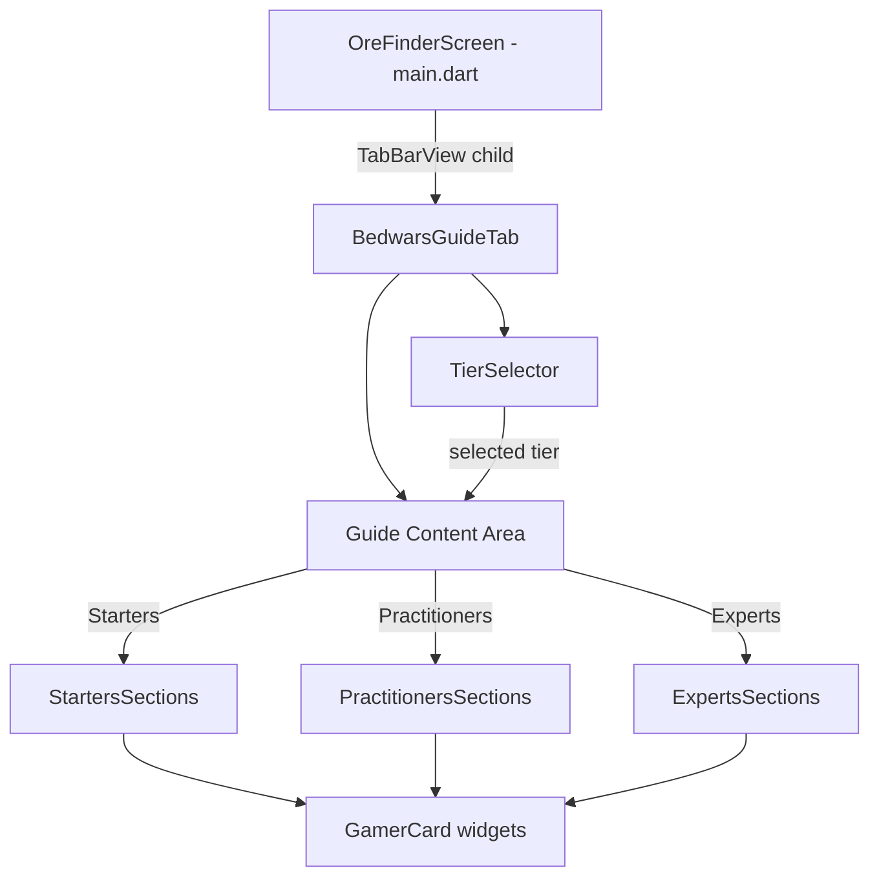

# Design Document: Bedwars Guide

## Overview

This feature adds a "Bedwars" tab to the Gem, Ore & Struct Finder Flutter app, providing Minecraft Bedwars gameplay guidance organized into three skill tiers: Starters, Practitioners, and Experts. The tab integrates into the existing `TabBar` navigation (becoming the 5th tab) and follows the app's established gamer theme with neon accents and dark/light mode support.

The guide content is static (no network calls or persistence needed). Users select a tier via a segmented selector pinned at the top, and the corresponding guide sections render as scrollable `GamerCard` widgets below.

## Architecture

The feature is purely presentational — a new widget tree added to the existing tab navigation. No new services, state management, or data fetching is required.



### Integration Point

In `main.dart`, the `TabController` length changes from 4 to 5. A new `Tab` entry ("Bedwars" with an icon) is added to the `TabBar`, and `BedwarsGuideTab` is added to the `TabBarView` children.

## Components and Interfaces

### 1. BedwarsGuideTab (StatefulWidget)

The root widget for the Bedwars guide tab.

```dart
class BedwarsGuideTab extends StatefulWidget {
  final bool isDarkMode;
  const BedwarsGuideTab({super.key, required this.isDarkMode});
}
```

**State:**
- `_selectedTier` — enum value tracking the currently selected skill tier (defaults to `SkillTier.starters`)

**Responsibilities:**
- Renders the `TierSelector` at the top (pinned, not scrollable)
- Renders the appropriate tier content in a `SingleChildScrollView` below the selector
- Passes `isDarkMode` through to child widgets

### 2. SkillTier (Enum)

```dart
enum SkillTier { starters, practitioners, experts }
```

Simple enum with three values. Each value maps to a display label and accent color.

### 3. TierSelector (StatelessWidget)

A row of three selectable chips/buttons for tier switching.

```dart
class TierSelector extends StatelessWidget {
  final SkillTier selectedTier;
  final ValueChanged<SkillTier> onTierChanged;
  final bool isDarkMode;
}
```

Uses `GamerColors` neon palette for the selected state highlight. Remains visible at the top while content scrolls beneath it.

### 4. Guide Section Data & Rendering

Each guide section is a simple data structure rendered as a `GamerCard`:

```dart
class GuideSection {
  final String title;
  final String emoji;
  final Color accentColor;
  final List<String> content;
}
```

The tier content is defined as static `List<GuideSection>` constants — one list per tier. The rendering reuses the same card-building pattern already established in `GuideTab._buildGuideCard()`.

### 5. main.dart Changes

- `TabController(length: 5, ...)`
- Add `Tab(icon: Icon(Icons.sports_esports), text: 'Bedwars')` to the `TabBar`
- Add `BedwarsGuideTab(isDarkMode: widget.isDarkMode)` to `TabBarView`

## Data Models

### SkillTier Enum

| Value | Label | Accent Color |
|-------|-------|-------------|
| `starters` | "Starters" | `GamerColors.neonGreen` |
| `practitioners` | "Practitioners" | `GamerColors.neonCyan` |
| `experts` | "Experts" | `GamerColors.neonPink` |

### GuideSection

| Field | Type | Description |
|-------|------|-------------|
| `title` | `String` | Section heading (e.g., "Basic Resource Gathering") |
| `emoji` | `String` | Emoji icon for the section header |
| `accentColor` | `Color` | Neon color for card border glow |
| `content` | `List<String>` | Lines of text; empty strings become spacing |

### Static Content

All guide content is defined as compile-time constants in the `BedwarsGuideTab` file (or a dedicated `bedwars_guide_data.dart`). No runtime data loading.

**Starters Tier Sections:**
1. Game Objective & Rules
2. Basic Resource Gathering (Iron & Gold)
3. Purchasing Essential Items
4. Basic Bed Defense
5. Basic Combat Tips

**Practitioners Tier Sections:**
1. Efficient Resource Management & Upgrades
2. Intermediate Bed Defense (Layering, Obsidian)
3. Team Coordination Strategies
4. Bridge-Building Techniques
5. Mid-Game Combat Tactics

**Experts Tier Sections:**
1. Advanced PvP Combat (Strafing, Combos, Rod Usage)
2. Speed-Bridging & Advanced Movement
3. Rush Strategies & Timing
4. Endgame Tactics & Resource Prioritization
5. Counter-Strategies Against Common Plays


## Correctness Properties

*A property is a characteristic or behavior that should hold true across all valid executions of a system — essentially, a formal statement about what the system should do. Properties serve as the bridge between human-readable specifications and machine-verifiable correctness guarantees.*

### Property 1: All guide sections have required fields

*For any* skill tier and *for any* guide section within that tier, the section must have a non-empty `title`, a non-empty `emoji`, and a non-empty `content` list with at least one non-empty string.

**Validates: Requirements 3.2, 4.2, 5.2**

### Property 2: Tier selection displays correct content

*For any* `SkillTier` value, when that tier is selected, the guide sections returned must exactly match the predefined static content list for that tier (same length, same titles, same content).

**Validates: Requirements 2.3**

## Error Handling

This feature is entirely static and presentational. There are no network calls, file I/O, or user input parsing that could fail at runtime.

| Scenario | Handling |
|----------|----------|
| Tab controller length mismatch | Compile-time — the `TabController(length: 5)` must match the number of `TabBarView` children |
| Invalid tier state | Not possible — `SkillTier` is a Dart enum with exactly 3 values; the switch is exhaustive |
| Empty content | Prevented by design — content is compile-time constants, validated by Property 1 |

No additional error handling logic is needed beyond what Flutter provides by default.

## Testing Strategy

### Unit Tests (flutter_test)

Unit tests cover specific examples and edge cases:

- **Tab presence**: Verify the Bedwars tab appears in the TabBar with the correct icon and "Bedwars" label (Requirements 1.1, 1.2)
- **Tab navigation**: Verify tapping the Bedwars tab displays the guide content area (Requirement 1.3)
- **Tier selector rendering**: Verify all three tier options ("Starters", "Practitioners", "Experts") are displayed (Requirement 2.1)
- **Default tier**: Verify Starters is selected by default on first navigation (Requirement 2.4)
- **Starters content sections**: Verify the starters tier contains the 5 required topic areas (Requirement 3.1)
- **Practitioners content sections**: Verify the practitioners tier contains the 5 required topic areas (Requirement 4.1)
- **Experts content sections**: Verify the experts tier contains the 5 required topic areas (Requirement 5.1)
- **Dark/light mode build**: Verify the widget builds without errors in both dark and light mode (Requirement 6.1)

### Property-Based Tests

Property-based tests use the `dart_check` package (or equivalent Dart PBT library) to verify universal properties across generated inputs.

Each property test runs a minimum of 100 iterations.

- **Property 1 test**: Generate random tier selections, retrieve the guide sections for that tier, and assert every section has non-empty title, non-empty emoji, and non-empty content.
  - Tag: `Feature: bedwars-guide, Property 1: All guide sections have required fields`

- **Property 2 test**: Generate random tier selections, retrieve the guide sections, and assert they exactly match the predefined static data for that tier.
  - Tag: `Feature: bedwars-guide, Property 2: Tier selection displays correct content`

Since the data is static (3 enum values mapping to fixed lists), the property tests effectively exhaustively verify the mapping for all possible inputs. The PBT framework ensures the test infrastructure is exercised correctly across randomized runs.

### Test Configuration

- Library: `dart_check` (Dart property-based testing library) added as a dev dependency
- Minimum iterations: 100 per property test
- Test files: `flutter_app/test/bedwars_guide_test.dart`
