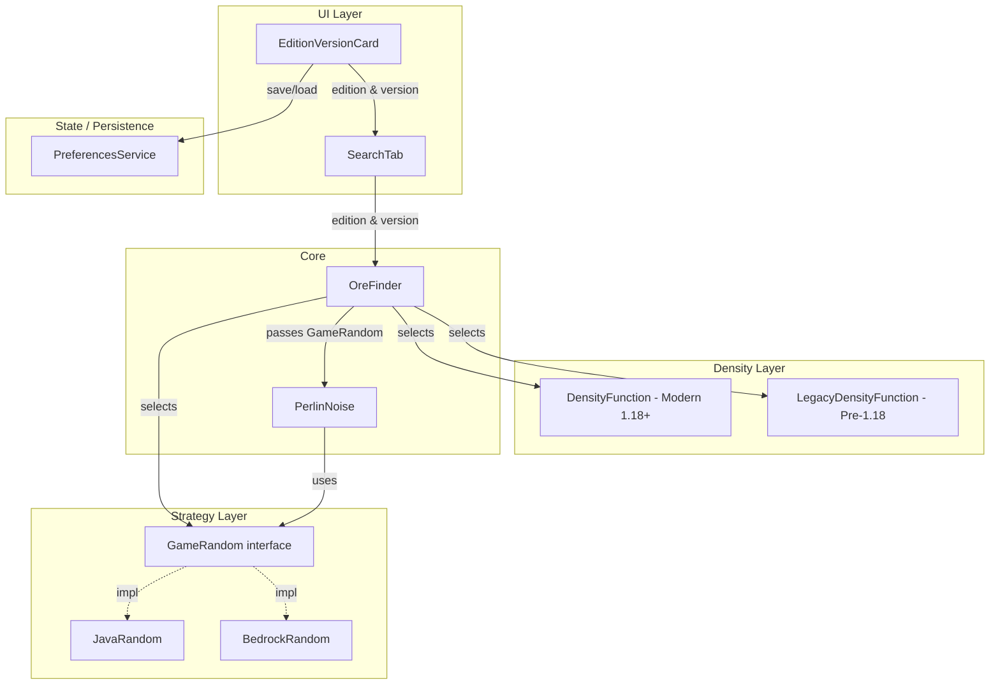

# Design Document: Edition & Version Selection

## Overview

This feature extends the Gem, Ore & Struct Finder app to support multiple Minecraft editions (Java and Bedrock) and version eras (pre-1.18 Legacy and 1.18+ Modern). Currently, the app hardcodes Java Edition 1.18+ behavior: `JavaRandom` for RNG, `PerlinNoise` with Java-seeded permutation tables, and `DensityFunction` using triangular distributions across the expanded -64 to 320 world depth.

The design introduces:

1. An **RNG strategy abstraction** (`GameRandom`) that both `JavaRandom` and a new `BedrockRandom` implement, decoupling the ore finder from a specific RNG.
2. A **`LegacyDensityFunction`** that uses uniform distributions with fixed Y ranges (the classic pre-1.18 model).
3. A **`BedrockRandom`** class replicating Bedrock Edition's C++ Mersenne Twister-based RNG.
4. An **`EditionVersionCard`** UI widget with segmented buttons for edition and version era selection, styled with the existing `GamerTheme`.
5. **Preference persistence** for edition and version era via the existing `PreferencesService`.
6. **Integration** into `OreFinder` and `PerlinNoise` so they accept the strategy and density function determined by the user's selections.

## Architecture



The key architectural decision is the **Strategy pattern** for RNG. `OreFinder` receives an edition enum and constructs the appropriate `GameRandom` implementation. Similarly, it receives a version era enum and constructs either `DensityFunction` or `LegacyDensityFunction`. This avoids conditional branching scattered throughout the ore-finding logic.

`PerlinNoise` is updated to accept a `GameRandom` instance instead of hardcoding `JavaRandom`, so permutation tables are generated with the edition-correct RNG.

## Components and Interfaces

### Enums

```dart
enum MinecraftEdition { java, bedrock }
enum VersionEra { legacy, modern }
```

### GameRandom (Abstract Interface)

```dart
abstract class GameRandom {
  void setSeed(int seed);
  int nextInt(int bound);
  int nextLong();
  double nextDouble();
  double nextFloat();
  bool nextBool();

  factory GameRandom.forEdition(MinecraftEdition edition, int seed) {
    switch (edition) {
      case MinecraftEdition.java:
        return JavaRandom(seed);
      case MinecraftEdition.bedrock:
        return BedrockRandom(seed);
    }
  }
}
```

`JavaRandom` is refactored to `implements GameRandom`. `BedrockRandom` is a new class that also `implements GameRandom`.

### BedrockRandom

Bedrock Edition uses a C++ `mt19937` (32-bit Mersenne Twister) seeded with the world seed. The implementation replicates the MT19937 algorithm:

- 624-element state array, 32-bit words
- Standard MT twist and temper operations
- `nextInt(bound)` uses rejection sampling (same as Java's approach but over 32-bit output)
- `nextLong()` combines two 32-bit outputs
- `nextDouble()` / `nextFloat()` scale from 32-bit output

This produces a different number sequence than `JavaRandom` for the same seed, which is the core behavioral difference between editions.

### LegacyDensityFunction

```dart
class LegacyDensityFunction {
  final PerlinNoise _noise;

  LegacyDensityFunction(int seed, {GameRandom? rng});

  double getOreDensity(double x, double y, double z, String oreType);
}
```

Uses uniform distribution within fixed Y ranges per ore type:
- Diamond: Y 1–15
- Gold: Y 1–31
- Iron: Y 1–63
- Coal: Y 1–127
- Redstone: Y 1–15
- Lapis: Y 14–30

Returns equal probability across the valid range (modulated by Perlin noise for spatial variation), and 0.0 outside it.

### PerlinNoise (Updated)

```dart
class PerlinNoise {
  PerlinNoise(int seed, {GameRandom? rng});
}
```

The `_generatePermutation` method accepts an optional `GameRandom`. If provided, it uses that for the Fisher-Yates shuffle; otherwise it falls back to creating a `JavaRandom` (backward compatible).

### OreFinder (Updated)

```dart
Future<List<OreLocation>> findOres({
  required String seed,
  required int centerX,
  required int centerY,
  required int centerZ,
  required int radius,
  required OreType oreType,
  bool includeNether = false,
  double minProbability = 0.5,
  MinecraftEdition edition = MinecraftEdition.java,
  VersionEra versionEra = VersionEra.modern,
}) async { ... }
```

Internally:
1. Creates `GameRandom` via `GameRandom.forEdition(edition, worldSeed)`.
2. Passes it to `PerlinNoise` and density function constructors.
3. Selects `DensityFunction` (modern) or `LegacyDensityFunction` (legacy) based on `versionEra`.
4. When `versionEra == VersionEra.legacy`, uses legacy Y ranges and world height 0–256.

### PreferencesService (Extended)

Two new key-value pairs:
- `'minecraft_edition'` → `'java'` | `'bedrock'` (default: `'java'`)
- `'version_era'` → `'legacy'` | `'modern'` (default: `'modern'`)

New static methods:
```dart
static Future<MinecraftEdition> getEdition() async { ... }
static Future<void> saveEdition(MinecraftEdition edition) async { ... }
static Future<VersionEra> getVersionEra() async { ... }
static Future<void> saveVersionEra(VersionEra era) async { ... }
```

### EditionVersionCard (New Widget)

A `GamerCard` with `GamerColors.neonOrange` accent containing:
1. `GamerSectionHeader` with emoji `🎮` and title "Edition & Version"
2. Edition `SegmentedButton<MinecraftEdition>` — "Java Edition" / "Bedrock Edition"
3. Version `SegmentedButton<VersionEra>` — "Pre-1.18 (Legacy)" / "1.18+ (Modern)"
4. Conditional info boxes (styled like `SearchButtons._buildInfoBox`):
   - Bedrock selected → approximate accuracy warning
   - Legacy selected → uniform distribution info with classic Y-level sweet spots

Placed in `SearchTab` above `WorldSettingsCard`.

## Data Models

### New Enums

| Enum | Values | Stored As |
|------|--------|-----------|
| `MinecraftEdition` | `java`, `bedrock` | String in SharedPreferences |
| `VersionEra` | `legacy`, `modern` | String in SharedPreferences |

### Legacy Ore Y Ranges

| Ore Type | Min Y | Max Y | Notes |
|----------|-------|-------|-------|
| Diamond | 1 | 15 | Sweet spot Y=12 |
| Gold | 1 | 31 | |
| Iron | 1 | 63 | |
| Coal | 1 | 127 | |
| Redstone | 1 | 15 | |
| Lapis | 14 | 30 | |

### World Height Bounds

| Version Era | Min Y | Max Y |
|-------------|-------|-------|
| Legacy | 0 | 256 |
| Modern | -64 | 320 |


## Correctness Properties

*A property is a characteristic or behavior that should hold true across all valid executions of a system — essentially, a formal statement about what the system should do. Properties serve as the bridge between human-readable specifications and machine-verifiable correctness guarantees.*

### Property 1: GameRandom output range invariants

*For any* `GameRandom` implementation (JavaRandom or BedrockRandom), *for any* valid seed, and *for any* positive bound:
- `nextInt(bound)` returns a value in `[0, bound)`
- `nextDouble()` returns a value in `[0.0, 1.0)`
- `nextFloat()` returns a value in `[0.0, 1.0)`
- `nextLong()` returns a 64-bit integer (no exception thrown)

**Validates: Requirements 3.1**

### Property 2: BedrockRandom and JavaRandom produce divergent sequences

*For any* seed value, the sequence of random numbers produced by `BedrockRandom(seed)` and `JavaRandom(seed)` SHALL differ. Specifically, calling `nextLong()` three times on each should produce at least one differing value.

**Validates: Requirements 3.4**

### Property 3: LegacyDensityFunction uniform range correctness

*For any* ore type and *for any* integer Y coordinate:
- If Y is within the ore's legacy range (diamond 1–15, gold 1–31, iron 1–63, coal 1–127, redstone 1–15, lapis 14–30), the Y-factor component of `getOreDensity` SHALL be equal (uniform) and greater than zero.
- If Y is outside the ore's legacy range, `getOreDensity` SHALL return 0.0.

Additionally, *for any* ore type and *for any* two Y values both within the valid legacy range, the Y-factor applied by `LegacyDensityFunction` SHALL be identical (confirming uniform distribution).

**Validates: Requirements 4.1, 4.4, 4.5**

### Property 4: Edition and version era preference round-trip

*For any* `MinecraftEdition` value, calling `PreferencesService.saveEdition(edition)` followed by `PreferencesService.getEdition()` SHALL return the same edition value.

*For any* `VersionEra` value, calling `PreferencesService.saveVersionEra(era)` followed by `PreferencesService.getVersionEra()` SHALL return the same era value.

**Validates: Requirements 6.1, 6.2**

### Property 5: Legacy mode restricts ore locations to legacy Y ranges

*For any* `MinecraftEdition` and *for any* ore type, when `versionEra` is `VersionEra.legacy`, all ore locations returned by `OreFinder.findOres` SHALL have Y coordinates within the legacy Y range for that ore type (and within world height 0–256).

**Validates: Requirements 4.6, 8.4**

### Property 6: Modern mode restricts ore locations to modern Y ranges

*For any* `MinecraftEdition` and *for any* ore type, when `versionEra` is `VersionEra.modern`, all ore locations returned by `OreFinder.findOres` SHALL have Y coordinates within the modern 1.18+ Y range for that ore type (within world depth -64 to 320).

**Validates: Requirements 8.5**

## Error Handling

| Scenario | Handling |
|----------|----------|
| `BedrockRandom.nextInt(bound)` with `bound <= 0` | Throw `ArgumentError` (same as `JavaRandom`) |
| Invalid/corrupt edition preference string in SharedPreferences | Return default `MinecraftEdition.java` |
| Invalid/corrupt version era preference string in SharedPreferences | Return default `VersionEra.modern` |
| `PerlinNoise` receives null `GameRandom` | Fall back to `JavaRandom` (backward compatible) |
| Legacy mode with Y coordinate below 0 or above 256 | `LegacyDensityFunction` returns 0.0; `OreFinder` skips those Y values |
| Bedrock edition + netherite search | Uses `BedrockRandom` for RNG but same netherite Y ranges (8–22) apply to both editions |

## Testing Strategy

### Unit Tests (Example-Based)

- **EditionVersionCard widget tests**: Verify segment labels, selection state changes, default selections, info box visibility for each edition/version combination, dark/light mode rendering, and widget ordering in SearchTab.
- **PreferencesService defaults**: Verify `getEdition()` returns `java` and `getVersionEra()` returns `modern` when no preference is stored.
- **OreFinder wiring**: Verify correct RNG and density function are selected for each edition/version combination.
- **BedrockRandom basic correctness**: Verify known MT19937 output values for specific seeds (reference values from C++ implementation).

### Property-Based Tests

Property-based tests use the `dart_quickcheck` or `glados` library (Dart PBT library) with a minimum of 100 iterations per property.

| Property | Test Description | Tag |
|----------|-----------------|-----|
| Property 1 | Generate random seeds and bounds, verify GameRandom output ranges | Feature: edition-version-selection, Property 1: GameRandom output range invariants |
| Property 2 | Generate random seeds, verify BedrockRandom ≠ JavaRandom sequences | Feature: edition-version-selection, Property 2: BedrockRandom and JavaRandom produce divergent sequences |
| Property 3 | Generate random ore types and Y values, verify LegacyDensityFunction range and uniformity | Feature: edition-version-selection, Property 3: LegacyDensityFunction uniform range correctness |
| Property 4 | Generate random edition/era enum values, verify save/load round-trip | Feature: edition-version-selection, Property 4: Edition and version era preference round-trip |
| Property 5 | Generate random editions and ore types in legacy mode, verify Y range constraints | Feature: edition-version-selection, Property 5: Legacy mode restricts ore locations to legacy Y ranges |
| Property 6 | Generate random editions and ore types in modern mode, verify Y range constraints | Feature: edition-version-selection, Property 6: Modern mode restricts ore locations to modern Y ranges |

### Integration Tests

- End-to-end test: Select Bedrock + Legacy, run a search, verify results use legacy Y ranges.
- End-to-end test: Select Java + Modern (default), run a search, verify results match current behavior.
- Preference persistence across app restart simulation.
