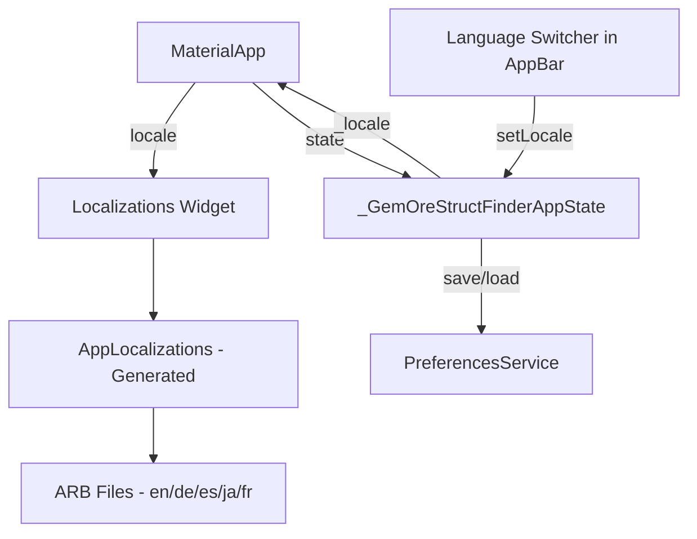

# Design Document: Multi-Language Support

## Overview

This design adds internationalization (i18n) to the Gem, Ore & Struct Finder for MC Flutter app using Flutter's official localization framework (`flutter_localizations` + `intl` with ARB files). The app currently has hundreds of hardcoded English strings across 13+ widget files. This feature will extract all user-facing strings into ARB translation files, add a language switcher to the AppBar, persist the user's language preference via the existing `PreferencesService`, and support five languages: English (en), German (de), Spanish (es), Japanese (ja), and French (fr).

The design leverages Flutter's built-in `Localizations` widget and code generation via `intl_utils` or `flutter gen-l10n` to produce type-safe accessor classes from ARB files.

## Architecture

The localization system integrates into the existing app architecture at three key points:

1. **MaterialApp configuration** — `localizationsDelegates`, `supportedLocales`, and `locale` properties
2. **State management** — A `Locale` field in `_GemOreStructFinderAppState` alongside the existing `_isDarkMode`, propagated via `MaterialApp.locale`
3. **Persistence** — A new `locale` key in `PreferencesService` using the existing `shared_preferences` dependency



### Key Design Decisions

1. **Flutter's built-in `gen-l10n`** over third-party packages (easy_localization, etc.) — keeps dependencies minimal, uses official tooling, and generates type-safe code.
2. **ARB files** as the single source of truth — standard format, tooling support, easy for translators.
3. **Locale state at the root widget** — setting `MaterialApp.locale` ensures all Material widgets (date pickers, back buttons, etc.) also respect the language.
4. **Existing `PreferencesService` for persistence** — no new dependencies needed; just add a `locale` key.
5. **Globe icon in AppBar** — a `PopupMenuButton` with `Icons.language` that shows all five languages with native names.

## Components and Interfaces

### 1. Localization Files (ARB)

Location: `flutter_app/lib/l10n/`

| File | Purpose |
|------|---------|
| `app_en.arb` | English (template) — contains all keys with `@` descriptions |
| `app_de.arb` | German translations |
| `app_es.arb` | Spanish translations |
| `app_ja.arb` | Japanese translations |
| `app_fr.arb` | French translations |

ARB keys will follow a naming convention: `{widget}_{description}`, e.g.:
- `appTitle` — "Gem, Ore & Struct Finder"
- `searchTab` — "Search"
- `resultsTab` — "Results"
- `guideTab` — "User Guide"
- `bedwarsTab` — "Bedwars"
- `updatesTab` — "Updates"
- `worldSeedLabel` — "World Seed"
- `searchRadiusLabel` — "Search Radius (blocks)"
- `resultsCount` — "{count} results · {oreCount} ores · {structureCount} structures" (parameterized)
- `errorEmptySeed` — "Please enter a world seed"
- `copiedCoordinates` — "Copied coordinates: {coords}"

Parameterized strings use ICU message format: `{count, plural, =0{No results} =1{1 result} other{{count} results}}`.

### 2. Generated Localization Class

`flutter gen-l10n` generates `AppLocalizations` and `AppLocalizations_XX` delegate classes.

Configuration in `flutter_app/l10n.yaml`:
```yaml
arb-dir: lib/l10n
template-arb-file: app_en.arb
output-localization-file: app_localizations.dart
output-class: AppLocalizations
nullable-getter: false
```

Usage in widgets:
```dart
final l10n = AppLocalizations.of(context);
Text(l10n.appTitle)
```

### 3. Language Switcher Widget

A `PopupMenuButton<Locale>` placed in the AppBar `actions` list, between the info button and theme toggle.

```dart
PopupMenuButton<Locale>(
  icon: Icon(Icons.language),
  tooltip: 'Language',
  onSelected: (locale) => onLocaleChanged(locale),
  itemBuilder: (context) => [
    _buildLanguageItem(Locale('en'), 'English', currentLocale),
    _buildLanguageItem(Locale('de'), 'Deutsch', currentLocale),
    _buildLanguageItem(Locale('es'), 'Español', currentLocale),
    _buildLanguageItem(Locale('ja'), '日本語', currentLocale),
    _buildLanguageItem(Locale('fr'), 'Français', currentLocale),
  ],
)
```

Each menu item shows a check mark next to the currently active locale.

### 4. PreferencesService Extension

Add to `PreferencesService`:
```dart
static const String _localeKey = 'app_locale';

static Future<String?> getLocale() async {
  final prefs = await SharedPreferences.getInstance();
  return prefs.getString(_localeKey);
}

static Future<void> saveLocale(String localeCode) async {
  final prefs = await SharedPreferences.getInstance();
  await prefs.setString(_localeKey, localeCode);
}
```

### 5. Root Widget State Changes

`_GemOreStructFinderAppState` gains:
- `Locale? _locale` field (null = English default)
- `_loadLocale()` called in `initState` to read saved preference
- `_setLocale(Locale locale)` that calls `setState` + `PreferencesService.saveLocale`
- `MaterialApp.locale` set to `_locale`
- `MaterialApp.localizationsDelegates` and `supportedLocales` configured

### 6. Widget String Replacement

All 13+ widget files will replace hardcoded strings with `AppLocalizations.of(context).keyName`. Files affected:

| Widget File | Approximate String Count |
|---|---|
| `main.dart` | ~15 (tab labels, app title, snackbar messages) |
| `search_tab.dart` | ~5 |
| `search_buttons.dart` | ~10 |
| `results_tab.dart` | ~20 |
| `guide_tab.dart` | ~80+ (ore guide content) |
| `bedwars_guide_tab.dart` | ~60+ |
| `app_info_dialog.dart` | ~40+ |
| `release_notes_tab.dart` | ~30+ |
| `ore_selection_card.dart` | ~10 |
| `structure_selection_card.dart` | ~10 |
| `world_settings_card.dart` | ~8 |
| `search_center_card.dart` | ~10 |
| `recent_seeds_widget.dart` | ~3 |

## Data Models

### Locale Configuration

```dart
// Supported locales constant
const supportedLocales = [
  Locale('en'), // English (default)
  Locale('de'), // German
  Locale('es'), // Spanish
  Locale('ja'), // Japanese
  Locale('fr'), // French
];

// Language display names (for the switcher menu)
const languageNames = {
  'en': 'English',
  'de': 'Deutsch',
  'es': 'Español',
  'ja': '日本語',
  'fr': 'Français',
};
```

### ARB Template Structure (app_en.arb excerpt)

```json
{
  "@@locale": "en",
  "appTitle": "Gem, Ore & Struct Finder",
  "@appTitle": { "description": "Main app title in AppBar" },
  "searchTab": "Search",
  "@searchTab": { "description": "Search tab label" },
  "resultsCount": "{total} results · {oreCount} ores · {structureCount} structures",
  "@resultsCount": {
    "description": "Results summary with counts",
    "placeholders": {
      "total": { "type": "int" },
      "oreCount": { "type": "int" },
      "structureCount": { "type": "int" }
    }
  },
  "errorEmptySeed": "Please enter a world seed",
  "@errorEmptySeed": { "description": "Validation error for empty seed field" }
}
```

### Persistence Model

The locale is stored as a simple string (`"en"`, `"de"`, `"es"`, `"ja"`, `"fr"`) in `shared_preferences` under the key `app_locale`. On startup, if the key is absent or contains an unsupported value, the app defaults to `en`.


## Correctness Properties

*A property is a characteristic or behavior that should hold true across all valid executions of a system — essentially, a formal statement about what the system should do. Properties serve as the bridge between human-readable specifications and machine-verifiable correctness guarantees.*

### Property 1: Translation completeness

*For any* translation key defined in the English template and *for any* supported locale (en, de, es, ja, fr), the localization system should return a non-null, non-empty string.

**Validates: Requirements 1.1, 5.4**

### Property 2: Locale persistence round-trip

*For any* supported locale code (en, de, es, ja, fr), saving it via `PreferencesService.saveLocale` and then loading it via `PreferencesService.getLocale` should return the same locale code.

**Validates: Requirements 4.1, 4.2, 4.4**

### Property 3: UI locale reactivity

*For any* supported locale, when the user selects that locale from the language switcher, all visible user-facing strings (tab labels, AppBar title, card headers, button labels) should update to the translations for that locale without requiring a restart.

**Validates: Requirements 3.1, 3.2, 3.3, 7.1, 7.2, 7.3**

### Property 4: Parameterized string interpolation

*For any* parameterized translation string and *for any* valid parameter values (e.g., integer counts, coordinate strings), the formatted output should contain the string representation of each parameter value.

**Validates: Requirements 5.2**

### Property 5: Error message localization

*For any* supported locale and *for any* error condition (validation errors, search errors, snackbar messages), the displayed error message should be a non-empty string from the active locale's translations, not a hardcoded English string.

**Validates: Requirements 8.1, 8.2, 8.3**

## Error Handling

| Scenario | Handling |
|---|---|
| Saved locale code is invalid/unsupported | Default to English (`en`) |
| Saved locale key is missing from storage | Default to English (`en`) |
| `SharedPreferences` fails to load | App starts with English; no crash |
| Translation key missing in non-English ARB | `gen-l10n` enforces completeness at build time; runtime fallback to English via Flutter's `Localizations` resolution |
| Japanese font not available on device | Flutter's default font fallback chain handles CJK; consider bundling Noto Sans JP as a fallback |
| Locale change during active search | Search continues; results display updates when search completes and widget rebuilds |

## Testing Strategy

### Unit Tests

- Verify `PreferencesService.saveLocale` / `getLocale` round-trip for each supported locale
- Verify default locale is `en` when no preference is saved
- Verify invalid locale codes fall back to `en`
- Verify parameterized strings produce expected output for known inputs (e.g., `resultsCount(10, 7, 3)` → "10 results · 7 ores · 3 structures")

### Widget Tests

- Verify language switcher is present in AppBar
- Verify tapping language switcher shows all 5 languages with native names
- Verify selecting a language updates tab labels and AppBar title
- Verify current locale is indicated (check mark) in the language menu
- Verify validation error messages display in the selected locale
- Verify snackbar messages display in the selected locale

### Property-Based Tests

Library: `dart_quickcheck` or `fast_check` for Dart property-based testing. If unavailable, use `test` package with custom generators iterating over all supported locales and all translation keys.

Each property test runs a minimum of 100 iterations.

Each test is tagged with a comment referencing the design property:
```dart
// Feature: multi-language-support, Property 1: Translation completeness
// Feature: multi-language-support, Property 2: Locale persistence round-trip
// Feature: multi-language-support, Property 4: Parameterized string interpolation
```

- **Property 1 (Translation completeness)**: Generate all combinations of (key, locale) and assert each returns a non-empty string.
- **Property 2 (Locale persistence round-trip)**: For each supported locale code, save then load and assert equality.
- **Property 3 (UI locale reactivity)**: Widget test that iterates over all locales, sets each, and verifies tab labels match expected translations.
- **Property 4 (Parameterized string interpolation)**: Generate random integer values for parameterized strings and verify the output contains those values as substrings.
- **Property 5 (Error message localization)**: For each locale, trigger each error condition and verify the message is non-empty and differs from the English version (for non-English locales) or matches (for English).
